# Hey, I'm Nicolas!

- 🎓 Student & tech enthusiast  
- 💻 Into **PC hardware**, **VR**, and experimenting with cool stuff  
- 🕶️ Curious about immersive tech & how things work under the hood  

## ⏱️ About me

<!-- AGE_START -->
- 🎈 I was born 173,234 hours ago
<!-- AGE_END -->
- 💻 Loves **VR**, **PC building**, and tech tinkering  
- 🔍 Enjoys understanding systems, networks, and software internals  
- 🚀 Always learning, always experimenting

## 📊 GitHub stats

  

⭐ *Thanks for stopping by!*
